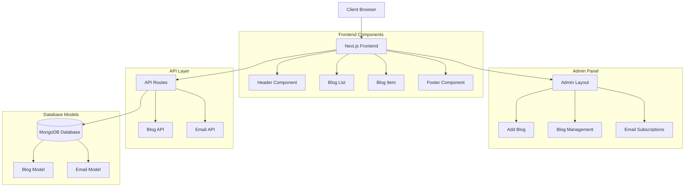
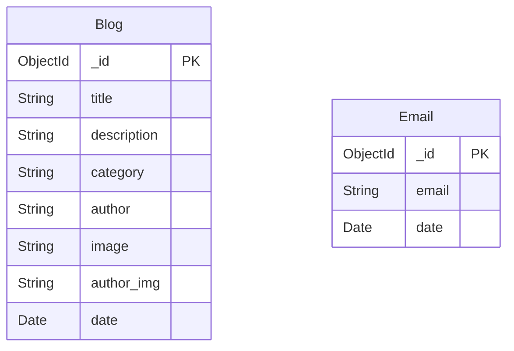

# Modern Blog Platform

A full-stack blog application built with Next.js 14 and MongoDB, featuring a modern admin panel, email subscriptions, and responsive design.

[](https://nextjs.org/)
[](https://reactjs.org/)
[](https://mongodb.com/)
[](https://tailwindcss.com/)
[](https://vercel.com/)

[](https://blogger.chahatkesh.me)

## Overview

This is a modern, responsive blog platform that provides a seamless experience for both readers and content creators. The application features a clean, professional design with a comprehensive admin panel for content management and user engagement tracking.

## Architecture



## Features

### Core Functionality
- **Dynamic Blog System**: Create, read, update, and delete blog posts
- **Category Filtering**: Filter blogs by Technology, Startup, and Lifestyle categories
- **Responsive Design**: Optimized for desktop, tablet, and mobile devices
- **Image Management**: Upload and manage blog thumbnails and author images
- **Email Subscriptions**: Newsletter subscription system with admin management

### Admin Panel
- **Content Management**: Full CRUD operations for blog posts
- **Rich Media Upload**: Image upload with automatic file handling
- **Subscription Management**: View and manage email subscribers
- **Analytics Dashboard**: Track blog engagement and subscriber metrics

### User Experience
- **Modern UI/UX**: Clean, professional design with hover effects and animations
- **Fast Loading**: Optimized with Next.js for excellent performance
- **SEO Friendly**: Server-side rendering for better search engine visibility
- **Social Sharing**: Integrated social media sharing capabilities

## Technology Stack

### Frontend
- **Next.js 14.2.4** - React framework with App Router
- **React 18** - User interface library
- **TailwindCSS 3.4.1** - Utility-first CSS framework
- **Next/Image** - Optimized image component
- **React Toastify** - Toast notifications

### Backend
- **Next.js API Routes** - Serverless API endpoints
- **MongoDB 8.4.4** - NoSQL database
- **Mongoose** - MongoDB object modeling
- **Node.js** - Runtime environment

### Development Tools
- **ESLint** - Code linting
- **PostCSS** - CSS processing
- **Axios** - HTTP client for API requests

## Database Schema



## API Endpoints

### Blog Management
```
GET    /api/blog           - Fetch all blogs or specific blog by ID
POST   /api/blog           - Create new blog post
DELETE /api/blog?id={id}   - Delete blog post
```

### Email Subscriptions
```
GET    /api/email          - Fetch all email subscriptions
POST   /api/email          - Subscribe email address
DELETE /api/email?id={id}  - Remove email subscription
```

## Project Structure

```
blog-app/
├── app/                          # Next.js App Router
│   ├── admin/                    # Admin panel pages
│   │   ├── addProduct/           # Blog creation page
│   │   ├── blogList/             # Blog management page
│   │   └── subscriptions/        # Email management page
│   ├── api/                      # API routes
│   │   ├── blog/                 # Blog CRUD operations
│   │   └── email/                # Email subscription handling
│   ├── blogs/[id]/               # Dynamic blog post pages
│   └── layout.js                 # Root layout
├── Components/                   # Reusable React components
│   ├── AdminComponents/          # Admin-specific components
│   ├── BlogItem.jsx              # Individual blog card
│   ├── BlogList.jsx              # Blog listing with filters
│   ├── Header.jsx                # Site header and navigation
│   └── Footer.jsx                # Site footer
├── lib/                          # Utility libraries
│   ├── config/db.js              # Database connection
│   └── models/                   # Mongoose schemas
├── Assets/                       # Static assets and icons
└── public/                       # Public files and uploads
```

## Installation and Setup

### Prerequisites
- Node.js 18+ 
- MongoDB Atlas account or local MongoDB installation
- Git

### Local Development

1. **Clone the repository**
   ```bash
   git clone https://github.com/chahatkesh/blog-app.git
   cd blog-app
   ```

2. **Install dependencies**
   ```bash
   npm install
   ```

3. **Environment Configuration**
   
   Create a `.env.local` file in the root directory:
   ```env
   MONGODB_URI=your_mongodb_connection_string
   ```

4. **Start development server**
   ```bash
   npm run dev
   ```

5. **Access the application**
   - Frontend: http://localhost:3000
   - Admin Panel: http://localhost:3000/admin

### Production Build

```bash
npm run build
npm start
```

## Usage Guide

### For Content Creators

1. **Access Admin Panel**: Navigate to `/admin` or click "Get Started"
2. **Create Blog Post**: 
   - Upload thumbnail image
   - Enter title and description
   - Select category (Technology, Startup, Lifestyle)
   - Set author information
3. **Manage Content**: View, edit, or delete existing blog posts
4. **Monitor Engagement**: Track email subscriptions and reader engagement

### For Readers

1. **Browse Blogs**: Filter by categories or view all posts
2. **Read Articles**: Click on any blog card to read the full article
3. **Subscribe**: Enter email address to receive newsletter updates
4. **Share Content**: Use social sharing buttons on blog posts

## Deployment

The application is deployed on Vercel and can be accessed at:
**[blogger.chahatkesh.me](https://blogger.chahatkesh.me)**

### Deploy to Vercel

1. Fork this repository
2. Connect your GitHub account to Vercel
3. Import the project to Vercel
4. Add environment variables in Vercel dashboard
5. Deploy automatically with each push to main branch

## Performance Features

- **Server-Side Rendering**: Fast initial page loads
- **Image Optimization**: Automatic image compression and formatting
- **Code Splitting**: Reduced bundle sizes for faster loading
- **Responsive Images**: Adaptive images for different screen sizes
- **Caching**: Optimized caching strategies for better performance

## Browser Support

- Chrome (latest)
- Firefox (latest)
- Safari (latest)
- Edge (latest)

## Development Workflow

```mermaid
gitgraph
    commit id: "Initial Setup"
    branch feature
    checkout feature
    commit id: "Add Feature"
    commit id: "Write Tests"
    checkout main
    merge feature
    commit id: "Deploy to Production"
```
